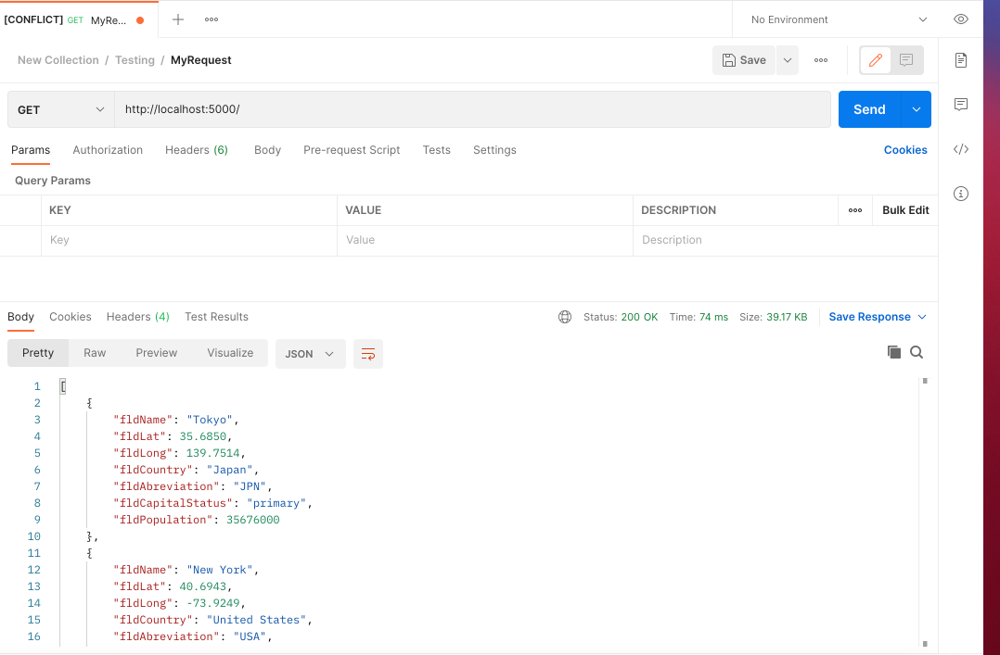
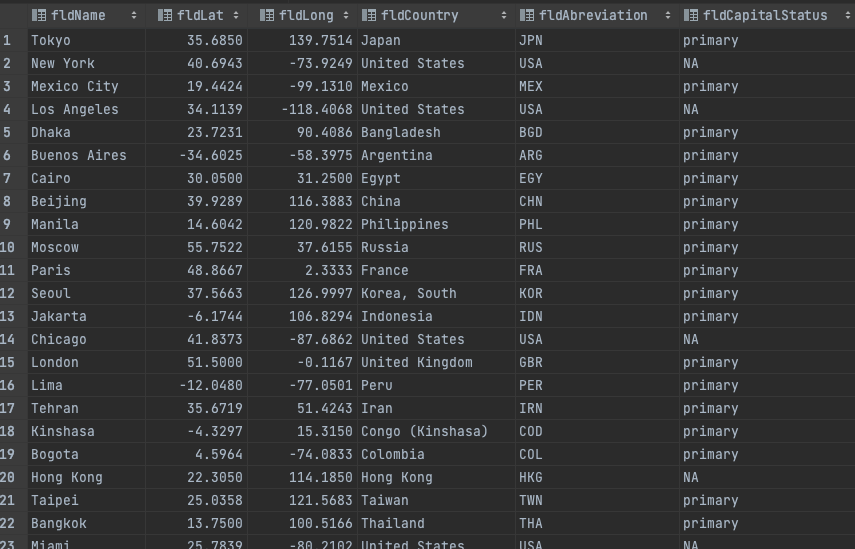

#Project Description
This is a homework assignment to teach how to get Pycharm setup with Docker, Flask, MYSQL, and Postman

[Download Assignment Here](PPFSQL-Homwork.pdf)
[view Assignment Video Here]()

#Postman Screenshot

#SQL Data Screenshot

